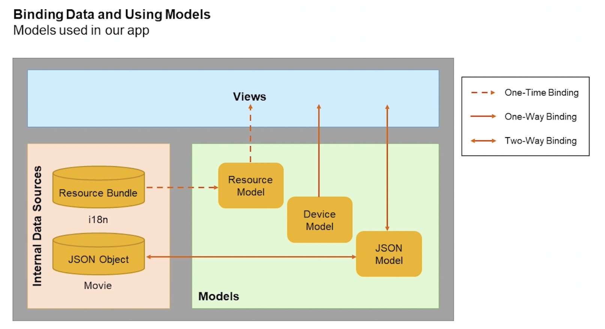

# [Evolved Web Apps with SAPUI5](https://open.sap.com/courses/ui52)

## General

**Key highlights of the course**:

* Evolved best practices and recommendations for app developers
* New SAPUI5 innovations (drag&drop, OData V4, XML composites)
* Developer productivity tools and features in SAP Web IDE (SAP Web IDE has been replaced by [SAP Business Application Studio](https://developers.sap.com/tutorials/appstudio-onboarding.html)
* Optimizing apps with the UI5 tooling
* Configuring apps for SAP Fiori elements and SAP Fiori launchpad
* Adapting apps with SAPUI5 flexibility

**Development System**

* SAP Web IDE (SAP Web IDE has been replaced by [SAP Business Application Studio](https://developers.sap.com/tutorials/appstudio-onboarding.html)
* SAP Cloud Platform trial
* UI5 Tooling
* SAP Gateway demo system ES5
* **Local environment**

For further learning, we recommend that you check out the [SAP Leonardo learning journey](https://help.sap.com/learning-journeys/overview).

## Week 1 (Configuration & Development environment setup)

**Course goals**
* Learn essential UI5 basics and evolved best practices
* Deepen knowledge about advanced UI5 concepts
* Get to know the latest UI5 innovations

**Tips**

* Open **UI5 Diagnostics**: Ctrl + Option + Shift + S ('s' stands for for support)
* Open S**upport Assistant**: Ctrl + Option + Shift + P

## Week 2 (UI5 (re)discovery)

[From official documentation](https://sapui5.hana.ondemand.com/sdk/#/topic/be0cf40f61184b358b5faedaec98b2da.html) \
The descriptor for applications, components, and libraries (in short: app descriptor) is inspired by the WebApplication Manifest concept introduced by the W3C. \
The descriptor provides a central, machine-readable, and easy-to-access location for storing metadata associated with an application, an application component, or a library.

In this week you will get acquainted with:
* The latest best practices for developing web apps
* Using UI controls and control libraries
* Data Binding and usage of models
* Navigation through the views in the app
* How product standards are injected into the framework

The initial components are defined in a declarative way. Directly executable code is not used in the HTML files, because this makes the files vulnerable. \
Instead, a good practice is to enable the `ComponentSupport` module in the bootstrapping script. \
The `ComponentSupport` class provides functionality which allows you to declare your components in HTML.

Components are independent and reusable parts used in UI5 applications. \
The component configuration is stored in the `manifest.json` – the so called **application descriptor**.

The `routing` configuration is used to load and show the XML views of the application. \
It shows a single route to the app view in this project. \
The connection of the views is accomplished by triggering navigation events and letting the router do the work.

`Targets` are typically referenced in a route and define which view should be displayed when a route was hit. \
In the routing configuration, you can even add multiple targets for the same route. \
All the views configured in the respective targets will be instantiated automatically.

The model-view-controller pattern (MVC) applied in UI5, is reflected in the **webapp** folder structure:
* The **model** folder contains additional logic related to data models. \
  Models are used for data management and control filtering, sorting and formatting of data.
* The **view** folder contains views and fragments which define the UI of your app.
* The **controller** folder contains controllers and helper classes with logic to define the behavior of your views

```
webapp
├── Component.js
├── controller
│   └── App.controller.js
├── css
│   └── style.css
├── i18n
│   └── i18n.properties
├── images
│   └── MoviesHeader.png
├── index.html
├── manifest.json
├── model
│   └── models.js
└── view
    └── App.view.xml
```


Asynchronous loading of dependencies can be seen in the `App.controller.js` file included in the template. \
In the controller file, `sap.ui.define` is used for asynchronous loading of the controller base class before extending it.

### Week 2 Unit 2

When declaring events in the XML, you can also specify a list of parameters that are passed to the handler. \
The passed value can then be used directly in the controller method. \
You can specify JavaScript literals like strings, numbers, arrays, and objects. \
We can also use expression binding syntax and translated text from the i18n model, which will be explained in the next unit.

For very simple event handlers, you can directly define the event logic in the view. \
For demo purposes, show a simple message to the user, when they click on the image.

Related material
* [Blog: Event Parameter Syntax in XML views](https://blogs.sap.com/2018/08/09/ui5ers-buzz-34-new-event-parameter-syntax-in-xmlviews/)

**Controller Lifecycle Hooks**
* `onInit`
* `onExit`
* `onBeforeRendering`
* `onAfterRendering`

### Week 2 Unit 3

The data binding syntax allows you to make the following assignments:
* The curly brackets indicate the beginning and end of binding info to the browser
* `movies` is the data model name we set in your `manifest.json` file
* The close-angular-bracket character `">"` separates the model name from the binding path to a particular entry
* The `path` property of the data binding info is necessary when two properties are listed inside the data binding info. \
  This is called "complex binding syntax". \
  You apply the `formatter` and set the `templateSharable` property
* The `formatter` syntax points to your `formatDate` formatter method in your model folder

Data Binding Types


Diiferent ways of binding



Related material
* [Data Binding](https://openui5nightly.hana.ondemand.com/#/topic/e5310932a71f42daa41f3a6143efca9c)
* [Expression Binding](https://openui5nightly.hana.ondemand.com/#/topic/daf6852a04b44d118963968a1239d2c0)
* [Planning Calendar](https://openui5nightly.hana.ondemand.com/#/entity/sap.m.PlanningCalendar)

### Week 2 Unit 4

**What are targets?** \
Targets are typically referenced in a route and define which view should be displayed when a route was hit. \
In the routing configuration, you can even add multiple targets for the same route. \
All the views configured in the respective targets will be instantiated automatically.

**What is a route?** \
A route is a configuration using a target and a pattern and is a single route to a certain app view in a project. \
The routing configuration is responsible for loading and displaying the XML views of your app. \
You simply connect the views by triggering navigation events and let the route do the work.

It is good practice to create an empty app view and let the routing load and place all views inside the app. \
This way, the views are only loaded when the corresponding route has been hit.


### Week 2 Unit 5

The font name '72' stands for the year 1972 when SAP was founded. \
The font is available in the SAP Fiori Fundamentals package.

**Accessibility** is a key feature of SAP Fiori. \
The SAP Fiori Design Guidelines provide a set of accessibility guidelines for developers. \
The guidelines are based on the Web Content Accessibility Guidelines (WCAG) 2.0.
* High contrast themes
* Keyboard navigation
* Screen reader support

**Globalization** and localization are important aspects of SAP Fiori. \
* Translation - over 40 available languages
* Internationalization - date, time, number, currency, and measurement formats

**Security**
* HTML code is provided by the framework

See the [SAP Fiori Design Guidelines](https://experience.sap.com/fiori-design-web/globalization-and-localization/) for more information.

Landmarks are one of the ARIA attributes that provide significant immediate benefits to screen reader users
in that they identify the structure of a web page. \
By doing this, they enable a quick overview of a page, and make navigation much more effective

There are eight of these roles, each representing a block of content that occurs commonly on web pages:
* Banner, Complementary, Content Info, Form, Main, Navigation, Region, and Search.

> **Note**: \
Avoid using the landmark role as part of the label. For example, a navigation landmark with a label “Site
Navigation” will be announced by a screen reader as “Site Navigation Navigation". The label should simply
be “Site”.
